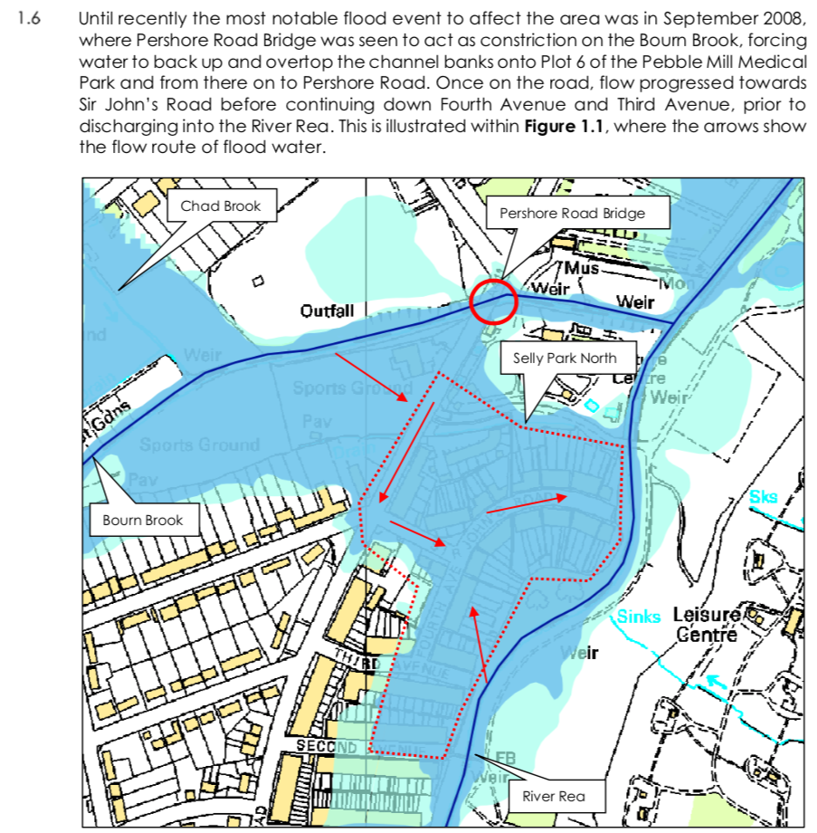

# Notes on the Selly Park floods

## September 6th, 2008

*   This flood briefly discussed in the [planning application for the current
    Pebble Mill build and flood relief
    works](http://eplanning.idox.birmingham.gov.uk/publisher/docs/4EE519570565026FC59CAF918FC33AF4/Document-4EE519570565026FC59CAF918FC33AF4.pdf):

    

*   [Discussed in more detail, by local
    resident](http://www.sellyparksouth.org.uk/files/SPS%20FLOOD%20REPORT%201.pdf)

    > I operate my own weather station in Selly Park which has yielded the
    > following data: Rainfall during the day on 06.09.2008 was 46.0mm. The
    > previous day it was 34.0mm. In the previous 6 days it was 86.6mm. For
    > comparison in a flood in 2007 which did not affect properties, rainfall
    > on 14.06.2007 was 91.5mm. Rainfall the previous day was only 11.8mm and
    > over the previous 13 days was only 4.3m. A few weeks later, rainfall on
    > 20.07.2007 was 55.0mm. The previous day it was only 6.0mm. In the
    > previous 5 days it was only 22.8mm. Again, properties were not flooded.

## June 16th, 2016

*   [BBC report](http://www.bbc.co.uk/news/uk-england-birmingham-36556884)
*   [Birmingham Mail
    report](https://www.birminghammail.co.uk/news/midlands-news/replay-birmingham-floods-storms-bring-11485242)

    > Over the past 12 hours there has been 43 millimetres of rain

*   [River management blog
    report](https://therivermanagementblog.wordpress.com/2016/08/16/looking-into-selly-park-flooding)
*   [Video of water flow from Pershore
    Road](https://www.reacatchmentpartnership.co.uk/extended-information/selly-park-north)
*   [Detailed analysis of flood by
    EA](http://www.sprca.net/wp-content/uploads/2017/01/SPRCA-General-Info-on-Scheme-and-Update-1.pdf)

## May 27th, 2018

*   [Article in
    Telegraph](https://www.telegraph.co.uk/news/2018/05/27/flash-floods-close-roads-birmingham).

    > The Met Office said a site at Winterbourne, in Edgbaston, recorded 58mm
    > of rainfall in just one hour on Sunday afternoon, and 81mm in a 12-hour
    > period.
